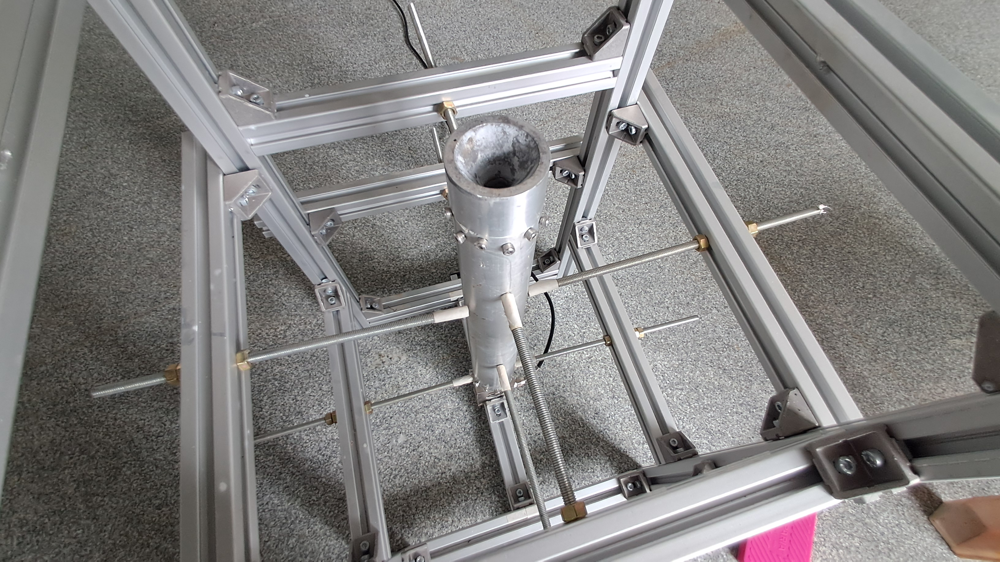
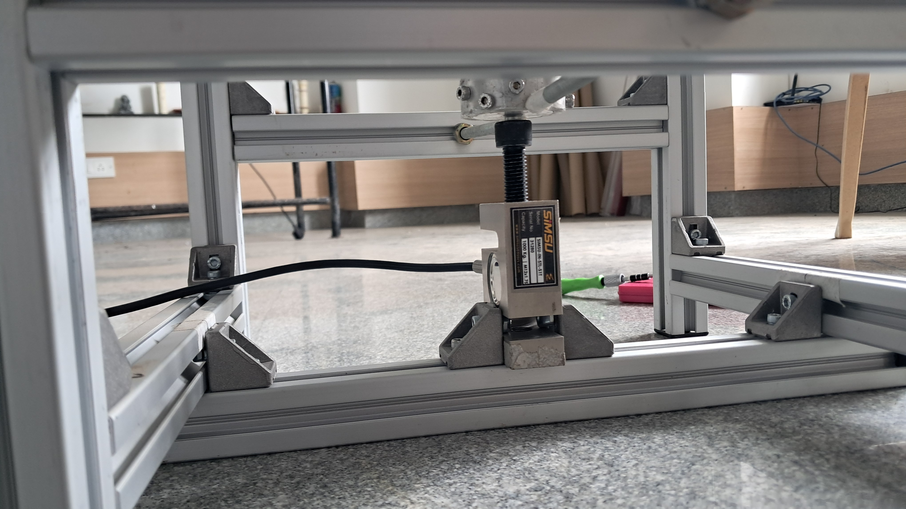
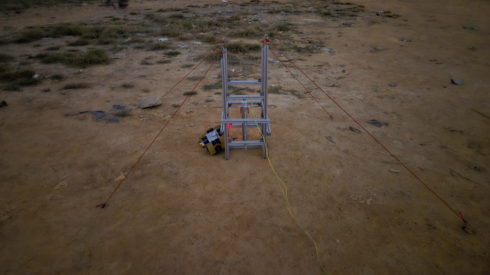

` Version: SR<document_number>-<year_YY.version.major_change.minor_change>`

# READ ME

Read [the Read Me file](https://starrocketry.github.io/projects/readme) before proceeding further.

---

# Overview

- **Members:** Dhruv Kakade, Abhay Nandan U, Akshay M, Athrv Kadam, Chethan S
- **Period:** [October 2025]

---

# Nomenclature

IMRC - IN-SPACe Model Rocketry Competition

# Manufacturing and Assembly

Uses M5 Allen Bolts, t-nuts and clamps. The test stand consists of the following components.

_Table 1: Bill of materials for test stand_

| Component                         | Specification     | Quantity |
| --------------------------------- | ----------------- | -------- |
| Extrusion Rods                    | 30x30mm, 300mm    | 8        |
| Extrusion Rods                    | 30x30mm, 400mm    | 5        |
| Extrusion Rods                    | 30x30mm, 1000mm   | 4        |
| Screw Rods                        | M8, 500mm         | 8        |
| 20x20 Clamps                      | -                 | 28       |
| Allen Bolts and t-nuts            | M5                | 58       |
| Loadcell                          | 1T Capacity       | 1        |
| Load Cell Allen Bolts and Nuts    | M12, 50mm         | 2        |
| Espressif 32                      | Node MCU, ESP32-S | 2        |
| Load Cell Amplifier Module        | HX711             | 1        |
| Relay                             | 30V 10A           | 1        |
| Tenka (点火) Assembly PCB Board\* | As per doc SR004  | 1        |

---

# Testing & Data

## Setup

The setup consists of a frame made of aluminum extrusion with a height of 1000mm and 300mm sides. there are 8 screw rods to support the motor vertically on the setup and such that it can help the motor to advance downward towards the loadcell applying a load to get the thrust readings by loadcell $mass*9.80665$. The following sections discuss about how the readings were taken and the safety precautions used and available at the site of testing.

## Instrumentation

The Node MCU Espressif 32 board was used as a micro-controller to calculate the thrust measured.

## Safety measures

A fire extinguisher and a bucket of water was near by such as to extinguish fire from any kind of a blast. The team for member maintained a distance of 75-100m away from the test stand and all the ignition was done wirelessly using the ESP-NOW protocol on Node MCU Espressif 32 boards as well as for transferring data. Through this setup. The setup can be done using a LoRa, XBee or similar radios that are capable of full duplex communication.

## Results

The test for a J-Class SRM was performed successfully and the following information was obtained through the static fire test.

---

# Gallery

_Figure 1: Test stand setup_

_Figure 2: Loadcell placement_

_Figure 3: Harnessed test stand on ground_

<video src="../../../../public/projects/test-stand/ts-working.mp4" controls  width="100%" height="auto">Static fire of the J-class SRM</video>

_Video 1: Static fire of the J-class SRM_

---

# CAD Model Download

The can models are designed and avaliable for download through Onshape as well as Autodesk Fusion 360 and are avaliable at [Onshape](https://cad.onshape.com/documents/720628e75abaa221e46fdd70/w/f80d0fb9936c0eb6af72f6f0/e/fd740d8ba7d706e13190d608?renderMode=0&uiState=6a3b669c6645666a4388d939) and [Fusion 360](https://a360.co/4gyId0Y)ch.

---

# Code

Open-sourced after the IMRC2026 Competition (Refer document [SR004-26](https://starrocketry.github.io/projects/sr004/)).

---

# Future Work

1. Update to reuseable E-matches by using Nichrome wires.
1.

---

## _\*to be open sourced after IMRC 2026_

---

#### Contact

- Co-Team Lead: Dhruv Kakade
- Email: ugcet2300660@reva.edu.in
