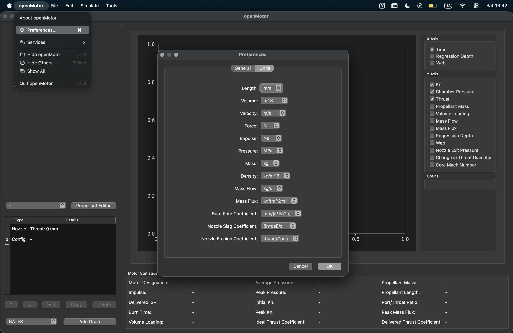
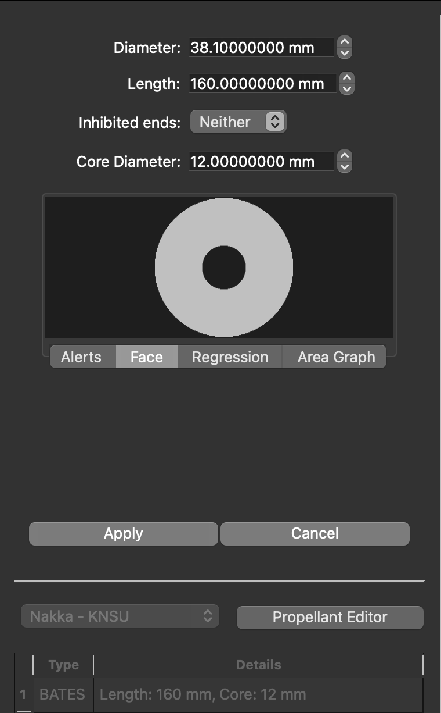
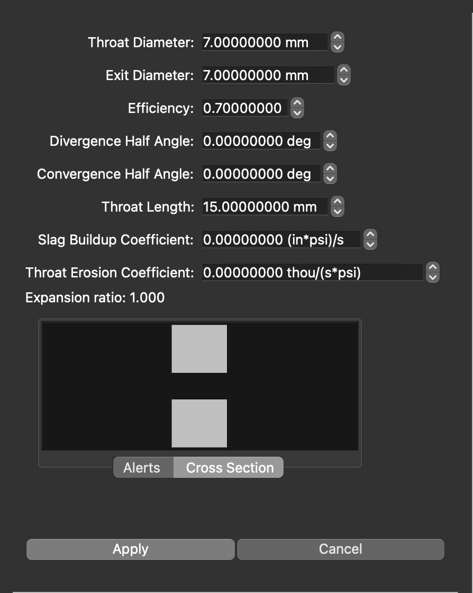
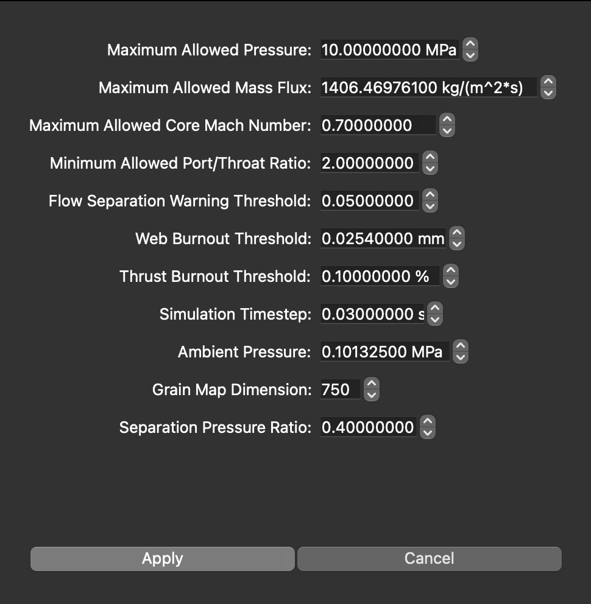

` Version: SR-<year_YY.version.major_change.minor_change>`

# READ ME

Read [the Read Me file](https://starrocketry.github.io/projects/readme) before proceeding further.

---

## Contribution

**Team Members:** Dhruv Kakade, Abhay Nandan U, Akshay M, Avik Rajeev Babu

**Volunteers**: Bhoomika S, Bhavana PH

### Dates

**Start:** 10th April 2026

**End:** 13th April 2026

---

# Workshop Teams

_Table 1. List of teams participated in the sounding rocket workshop 2026_
| Team Number | Team Name | Team Members | Launch Success |
| ----------- | -------------- | ----------------------------------------------------------------- | ------------------- |
| 01 | Nova Minds | Kadam Atharv Rabindra, Manish Megharaj, Harsha S.P., Nichal Reddy | Success |
| 02 | Budget Nasa | Dhanush, Neha, | TBL(To Be Launched) |
| 03 | Dark Magic | | TBL(To Be Launched) |
| 04 | RCB | Charu Latha K, Rithika B, Divya Rani, Hema | TBL(To Be Launched) |
| 05 | Lets get high | | TBL(To Be Launched) |
| 06 | Circ inifini | | TBL(To Be Launched) |
| 07 | bazoooka! | | TBL(To Be Launched) |
| 08 | Osama | Dev | TBL(To Be Launched) |
| 09 | India Flag | | TBL(To Be Launched) |
| 10 | Thrust Masters | Likith, Mamtha, Karthik, Naveena | TBL(To Be Launched) |
| 11 | Night Fury | Deepika Gowda, Dhruthi R, Nikita Mayya | TBL(To Be Launched) |

_The Rockets developed by the teams are shown after the workshop contents_

## Acronyms

SRM: Solid Rocket Motor

ORK: OpenRocket

BATES: Ballistic Test And Evaluation System

OS: Operating System

Softwares Used: OpenRocket, OpenMotor, SimScale, VSCode, PlatformIO,

> This Workshop was taught using a MacBook Air with the M2 processor running macOS 26 Tahoe.
> The following softwares and actions can be done using a Windows as well as a Unix based OS with
> atleast an Intel Core i3 with 4Gb RAM (Core i5 or similar AMD processor with 8Gb RAM are recommended)

## Airframe

Material: Cardboard
Outer Diameter (mm): 64
Thickness (mm): 2
Length (mm): 1000

## Solid Rocket Motor

- Class: H-Class
- Motor Designation: H
- Impulse (Ns):
- Isp (s):
- Grain Core Dia (mm): 12
- Grain Outer Dia (mm):

### OpenMotor (Version: 0.6.1)

Firstly set OpenMotor to your comfortable units at Edit > Preferences (On Windows) and OpenMotor > Preferences (or `CMD` + `,`) on macOS. The team used the following units for this workshop as shown in Fig. 1.

_Fig. 1: Unit preference used in OpenMotor_

The main step in simulating the motor is to define solid fuel geometry this is called a grain. \
This SRM uses a BATES grain structure. A BATES grain structure gives a progressive thrust and chamber
pressure variation and is also easy to manufacture hence used here, there are various other types of
grain used in SRMs you can see that here at our resource archive and the books referenced there.
Heading back to OpenMotor select the BATES option from the drop down then click on the add grain
button on the bottom of the left pane. Then enter the values of the motor as given in the Fig. 2.

_Fig. 2: Grain geometry of H-Class SRM_

Now below the grain details you have the nozzle tab click on that for the nozzle we will be using epoxy clay with a center drilled hole with 7mm diameter and and a throat length of 15mm. The value of efficiency is found by comparing the values of static tests conducted on a test stand and matching those values with open motor values by changing the efficiency value of the SRM. The following values were entered in OpenMotor for the nozzle section and the cross section is shown in Fig. 3. After entering the values click on apply.

_Fig.3: Nozzle geometry used in the SRM_

Head to Config below the nozzle tab and set the maximum pressure to

_Fig. 4: Configuration of the SRM_

## Design and Simulation Of The Model Rocket

## Nose Cone

## Fins

## Electronics

 
 
 

---

> For any errors, mistakes or any issues contact: **Dhruv Kakade** (Co-Team Lead), [ugcet2300660@reva.edu.in](mailto:ugcet2300660@reva.edu.in)
